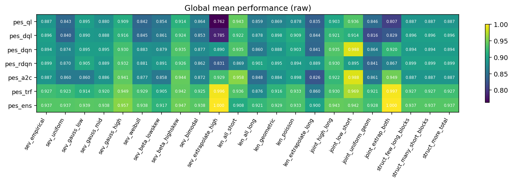
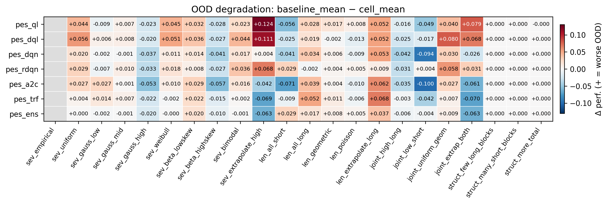
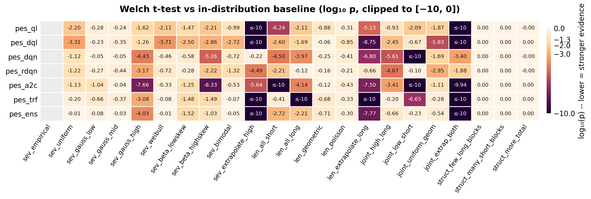
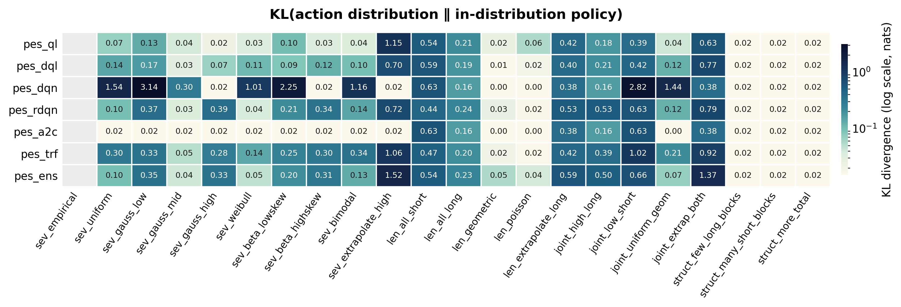

<div align="center">

# 🦠 mPES — *Multiple Pandemic Experiment Suite*

**A reinforcement-learning benchmark for resource allocation under uncertainty.**

[](https://www.python.org/)
[](https://www.tensorflow.org/)
[](https://optuna.org/)
[](https://gymnasium.farama.org/)
[](#-license)

</div>

> An agent must distribute **39 resources** across ≈ 360 trials
> (8 blocks × 8 sequences × 3–10 trials) to minimise disease severity.
> Eight algorithmic variants share the same experiment framework, making
> side-by-side comparison straightforward.

---

## ✨ Highlights

- 🧠 **Eight RL variants** under one roof — tabular, deep, recurrent, actor-critic, transformer, ensemble.
- 📊 **22-scenario OOD benchmark** ([`general/`](general/)) producing 9 statistical matrices and 4 publication-quality heatmaps (PNG + PDF).
- 🔬 **Bayesian hyperparameter optimisation** via Optuna for every learnable model.
- 🌍 **Cross-platform** — Windows 10 + Ubuntu, Python 3.12, parity in environment and entry points.
- 📚 **Documentation per package** (Markdown + KaTeX-rendered HTML).

---

## 📦 Packages

Packages are grouped by algorithm family under two top-level directories.

### `tabular/` — value-based tabular RL

| Package | Algorithm | Key files |
|---------|-----------|-----------|
| `pes_base` | Tabular Q-Learning *(baseline)* | [`ext/pandemic.py`](tabular/pes_base/ext/pandemic.py), [`ext/train_rl.py`](tabular/pes_base/ext/train_rl.py) |
| `pes_ql`   | Q-Learning + Bayesian optimisation | [`ext/optimize_rl.py`](tabular/pes_ql/ext/optimize_rl.py) |
| `pes_dql`  | Double Q-Learning + ε-decay warm-up + PBRS | [`ext/pandemic.py`](tabular/pes_dql/ext/pandemic.py), [`ext/optimize_rl.py`](tabular/pes_dql/ext/optimize_rl.py) |

### `ml/` — deep & neural RL

| Package | Algorithm | Key files |
|---------|-----------|-----------|
| `pes_dqn`  | Deep Q-Network (replay + target net) | [`ext/dqn_model.py`](ml/pes_dqn/ext/dqn_model.py), [`ext/train_dqn.py`](ml/pes_dqn/ext/train_dqn.py), [`ext/optimize_dqn.py`](ml/pes_dqn/ext/optimize_dqn.py) |
| `pes_rdqn` | Recurrent DQN (LSTM over trial history) | [`ext/rdqn_model.py`](ml/pes_rdqn/ext/rdqn_model.py), [`ext/train_rdqn.py`](ml/pes_rdqn/ext/train_rdqn.py), [`ext/optimize_rdqn.py`](ml/pes_rdqn/ext/optimize_rdqn.py) |
| `pes_a2c`  | Advantage Actor-Critic (separate actor + critic nets) | [`ext/ac_model.py`](ml/pes_a2c/ext/ac_model.py), [`ext/train_a2c.py`](ml/pes_a2c/ext/train_a2c.py), [`ext/optimize_a2c.py`](ml/pes_a2c/ext/optimize_a2c.py) |
| `pes_trf`  | Causal Transformer encoder + DQN (sliding window) | [`ext/transformer_model.py`](ml/pes_trf/ext/transformer_model.py), [`ext/train_transformer.py`](ml/pes_trf/ext/train_transformer.py), [`ext/optimize_tr.py`](ml/pes_trf/ext/optimize_tr.py) |
| `pes_ens`  | Ensemble (soft voting of `dqn` + `rdqn` + `trf`) | [`ext/ensemble_model.py`](ml/pes_ens/ext/ensemble_model.py) |

### Support directories

| Path | Purpose |
|------|---------|
| [`general/`](general/) | Cross-model OOD benchmark harness (22 scenarios × 7 models) |
| [`utils/`](utils/) | Cross-platform shell scripts, requirements, lint config |
| [`general/doc/`](general/doc/) | Cross-package theoretical comparison material |

---

## 🗂️ Package layout

```text
<group>/<pkg>/                 # <group> ∈ { tabular, ml }
├── __init__.py          # Config re-exports, ANSI codes, numpy/TF setup
├── __main__.py          # Experiment entry point (blocks/sequences/trials)
├── config/CONFIG.py     # All tuneable constants
├── doc/                 # Markdown & HTML documentation
├── ext/                 # Core algorithms (Gym env, training, optimisation)
├── inputs/              # Generated data (date-stamped subdirs)
├── outputs/             # Logs and results (date-stamped subdirs)
└── src/                 # Support modules
    ├── exp_utils.py        # Severity calculations, sequence helpers
    ├── log_utils.py        # Dual-stream logging (console + file)
    ├── pygameMediator.py   # Pygame UI bridge
    ├── result_formatter.py # Matplotlib result plots
    └── terminal_utils.py   # Rich console output (header, section, info…)
```

---

## ⚙️ Setup

### Requirements

| Dependency | Version | | Dependency | Version |
|-----------|---------|---|-----------|---------|
| Python     | 3.12    | | Optuna     | 4.7.0   |
| TensorFlow | 2.21.0  | | Gymnasium  | 1.2.3   |
| Keras      | 3.13.2  | | matplotlib | 3.10.8  |
| NumPy      | 2.4.3   | | scipy      | 1.17.1  |
| Pygame     | 2.5.2   | |            |         |

> Full list in [`utils/config/requirements.txt`](utils/config/requirements.txt).

### Virtual environment

```bash
# Linux
python3 -m venv linux_mpes_env
source linux_mpes_env/bin/activate
```

```powershell
# Windows (PowerShell)
python -m venv win_mpes_env
win_mpes_env\Scripts\Activate.ps1
```

### Install dependencies

```bash
pip install -r utils/config/requirements.txt
```

### Environment variables

Set these **before** running training or optimisation:

| Variable | Value | Purpose |
|----------|-------|---------|
| `VIRTUAL_ENV`           | path to active venv | Prevents `__init__.py` interactive prompt |
| `PYTHONIOENCODING`      | `utf-8`             | Avoids `UnicodeEncodeError` on Windows    |
| `TF_ENABLE_ONEDNN_OPTS` | `0`                 | Suppresses oneDNN info messages           |

---

## ▶️ Usage

### Run an experiment

```bash
python -m tabular.pes_base    # Tabular Q-Learning (baseline)
python -m tabular.pes_ql      # Q-Learning  (Optuna-tuned)
python -m tabular.pes_dql     # Double Q-Learning + PBRS

python -m ml.pes_dqn          # Deep Q-Network
python -m ml.pes_rdqn         # Recurrent DQN (LSTM)
python -m ml.pes_a2c          # Advantage Actor-Critic
python -m ml.pes_trf          # Causal Transformer DQN
python -m ml.pes_ens          # Ensemble (soft voting, no training)
```

### Train an agent

```bash
# --- Tabular models (Q-table episodes) ---
python -m tabular.pes_base.ext.train_rl   1000000
python -m tabular.pes_ql.ext.train_rl     1000000
python -m tabular.pes_dql.ext.train_rl    1000000

# --- Deep models (gradient steps / episodes) ---
python -m ml.pes_dqn.ext.train_dqn          175000
python -m ml.pes_rdqn.ext.train_rdqn        175000
python -m ml.pes_a2c.ext.train_a2c          175000
python -m ml.pes_trf.ext.train_transformer  175000

# pes_ens has no training phase; it loads pre-trained sibling models.
```

### Bayesian hyperparameter optimisation

```bash
# Linux
./utils/linux/run_bayesian_opt.sh bayesian    100  # pes_ql
./utils/linux/run_bayesian_opt.sh dql         100  # pes_dql
./utils/linux/run_bayesian_opt.sh dqn          30  # pes_dqn
./utils/linux/run_bayesian_opt.sh rdqn         30  # pes_rdqn
./utils/linux/run_bayesian_opt.sh ac           30  # pes_a2c
./utils/linux/run_bayesian_opt.sh transformer  30  # pes_trf
```

```powershell
# Windows (PowerShell)
.\utils\win\run_bayesian_opt.ps1 bayesian 100
.\utils\win\run_bayesian_opt.ps1 dqn       30
.\utils\win\run_bayesian_opt.ps1 ac        30
```

---

## 🦠 The Pandemic Scenario

| Aspect | Definition |
|--------|------------|
| **State space**  | `[resources_left (9–39), trial_number (0–10), severity (0–9)]` → 3 410 states |
| **Action space** | allocate 0–10 resources (11 discrete actions; over-allocation masked with `-1e9`) |
| **Dynamics**     | `new_severity = 1.4 · initial_severity − 0.4 · resources_allocated` |
| **Reward**       | negative cumulative severity (the agent **minimises** total damage) |

### Experiment hierarchy

```text
Experiment (1)
└── Block (8)
    └── Sequence / Map (8)
        └── Trial / City (3–10)
            └── Resource Decision (0–10)
```

**~ 360 total trials per experiment (~ 45 per block).**

---

## 📚 Documentation

Each package ships its own in-depth Markdown documentation under
[`<group>/<pkg>/doc/`](ml/pes_dqn/doc/) (Spanish). The cross-package
theoretical comparison lives at
[`general/doc/comparacion_modelos.md`](general/doc/comparacion_modelos.md).
All maths uses **inline KaTeX** (`$ … $`) so it renders natively on
GitHub.

| Package | Theory | Implementation guide |
|---------|--------|----------------------|
| `pes_base`  | [`theory_rl.md`](tabular/pes_base/doc/theory_rl.md) | [`explained_pes.md`](tabular/pes_base/doc/explained_pes.md) · [`how_to_train_and_test.md`](tabular/pes_base/doc/how_to_train_and_test.md) |
| `pes_ql`    | [`pes_ql_theory.md`](tabular/pes_ql/doc/pes_ql_theory.md) | [`pes_ql_explained.md`](tabular/pes_ql/doc/pes_ql_explained.md) |
| `pes_dql`   | [`pes_dql_theory.md`](tabular/pes_dql/doc/pes_dql_theory.md) | [`pes_dql_explained.md`](tabular/pes_dql/doc/pes_dql_explained.md) |
| `pes_dqn`   | [`pes_dqn_theory.md`](ml/pes_dqn/doc/pes_dqn_theory.md) | [`pes_dqn_explained.md`](ml/pes_dqn/doc/pes_dqn_explained.md) |
| `pes_rdqn`  | [`pes_rdqn_theory.md`](ml/pes_rdqn/doc/pes_rdqn_theory.md) | [`pes_rdqn_explained.md`](ml/pes_rdqn/doc/pes_rdqn_explained.md) |
| `pes_a2c`   | [`pes_a2c_theory.md`](ml/pes_a2c/doc/pes_a2c_theory.md) | [`pes_a2c_explained.md`](ml/pes_a2c/doc/pes_a2c_explained.md) |
| `pes_trf`   | [`pes_trf_theory.md`](ml/pes_trf/doc/pes_trf_theory.md) | [`pes_trf_explained.md`](ml/pes_trf/doc/pes_trf_explained.md) |
| `pes_ens`   | [`pes_ens_theory.md`](ml/pes_ens/doc/pes_ens_theory.md) | [`pes_ens_explained.md`](ml/pes_ens/doc/pes_ens_explained.md) · [`how_to_train_and_test.md`](ml/pes_ens/doc/how_to_train_and_test.md) |

---

## 📈 Cross-model OOD benchmark — `general/`

The [`general/`](general/) harness evaluates every model against a
catalogue of **22 out-of-distribution scenarios** (severity, length,
joint, structural families) and aggregates the results into nine
`matrix_*.csv` files plus four publication-quality heatmaps under
[`general/results/`](general/results/). The full sweep is **154 cells**
(7 models × 22 scenarios). See
[general/results/benchmark_report.md](general/results/benchmark_report.md)
for the full numerical analysis.

### Run the sweep

```bash
python -m general.scripts.orchestrate    # full 154-cell sweep (resumable)
python -m general.scripts.progress       # live progress bars + ETA
python -m general.scripts.aggregate      # build matrix_*.csv from raw/
python -m general.scripts.plot_matrix    # render heatmaps (PNG + PDF)
python -m general.scripts.report         # generate benchmark_report.md
```

### Heatmaps

All four heatmaps are written as both **`.png`** (300 dpi raster) and
**`.pdf`** (vector, TrueType-embedded) for direct inclusion in
publications. Cells use fixed colour-scale limits so figures from
different sweeps are directly comparable; clipped values are flagged
in-cell (`≤-10` in the Welch heatmap).

| Metric | Heatmap | Colour map | Scale |
|--------|---------|-----------|-------|
| Global mean performance | [PNG](general/results/heatmap_global_mean.png) · [PDF](general/results/heatmap_global_mean.pdf) | `viridis` | auto-bounded |
| OOD degradation (Δ vs baseline) | [PNG](general/results/heatmap_ood_degradation.png) · [PDF](general/results/heatmap_ood_degradation.pdf) | `RdBu_r` (diverging) | symmetric around 0 |
| Welch test, log₁₀(p) | [PNG](general/results/heatmap_welch_logp.png) · [PDF](general/results/heatmap_welch_logp.pdf) | `magma_r` | clipped to `[-10, 0]` |
| Action-distribution KL | [PNG](general/results/heatmap_action_kl.png) · [PDF](general/results/heatmap_action_kl.pdf) | `cividis` | `LogNorm` |

<div align="center">






</div>

### Headline conclusions

1. **Overall ranking** (mean performance across 22 scenarios):
   `pes_ens` (0.937) > `pes_trf` (0.927) > `pes_rdqn` (0.899) ≈
   `pes_dqn` (0.894) ≈ `pes_dql` (0.893) > `pes_a2c` (0.887) ≈
   `pes_ql` (0.887). The ensemble is the **only** model that stays
   ≥ 0.90 in every scenario.

2. **Best single (non-ensemble) model**: `pes_trf` — the only standalone
   model that *improves* under the toughest extrapolations
   (`sev_extrapolate_high`, `joint_extrap_both`) with very-large
   positive effect sizes (Cohen's d > +2).

3. **Most fragile**: `pes_dql` and `pes_ql` — largest mean degradation,
   only models with d < −1.5 on multiple scenarios; `pes_ql` collapses
   to a worst-sequence performance of **0.168** on `joint_low_short`.

4. **Three universal stressors** (p < 0.001 across all 7 models):
   `sev_extrapolate_high`, `len_extrapolate_long`, `joint_extrap_both`.
   Treat these as the headline benchmark cells.

5. **Three control columns** (`struct_*`): degradation = 0, p = 1.0,
   KL = 0 — they validate the harness rather than measure transfer.

6. **Hidden caveat — `pes_a2c`**: action-distribution KL is *exactly
   zero* on every severity scenario despite competitive scores. This
   signals partial **policy collapse** onto a robust default action
   sequence rather than genuine context-conditioning.

7. **Tail-risk safety**: `pes_ens` keeps a worst-sequence floor ≥ 0.57
   across the entire 22 × 64 grid; `pes_trf` ≥ 0.55. They are the
   safest choices when worst-case behaviour matters more than average.

8. **Family takeaways**:
   - **Severity** — deep models > tabular by a wide margin on the
     extrapolative tails; comparable on in-support reshapings.
   - **Length** — hardest family for everyone (`len_extrapolate_long`
     degrades all 7 models).
   - **Joint** — bimodal: catastrophic for tabular, *beneficial* for
     transformer / ensemble.
   - **Structural** — control band (sanity check).

---

## 📄 License

Private repository — all rights reserved.
