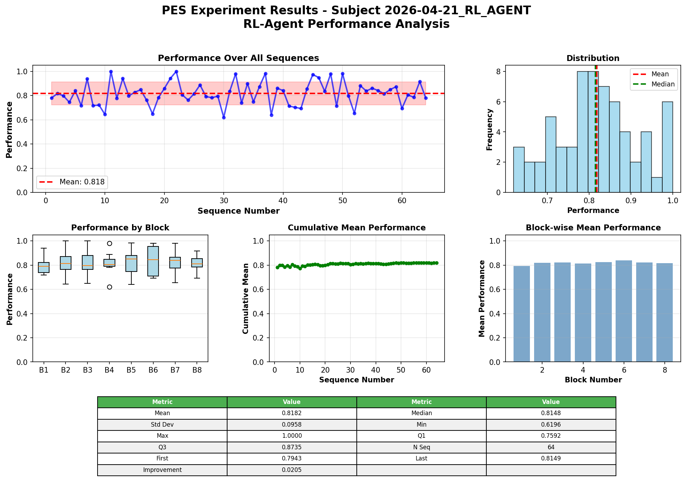
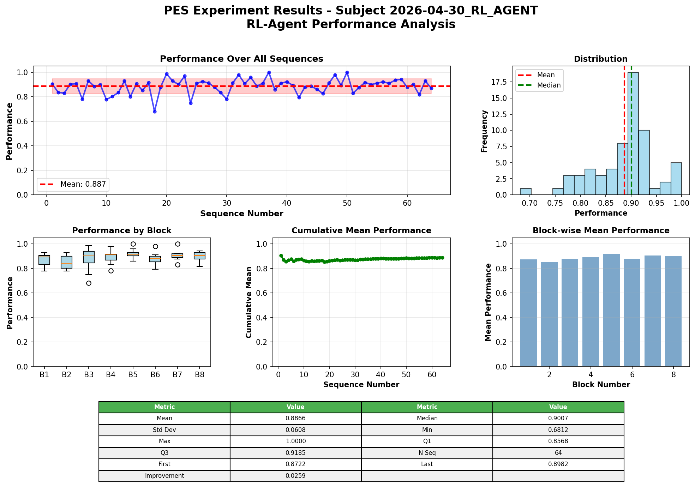
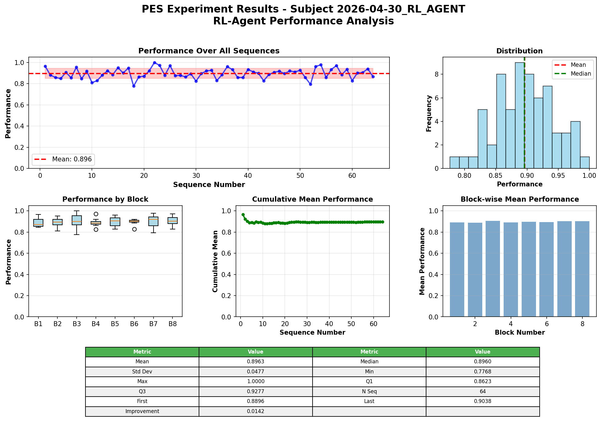
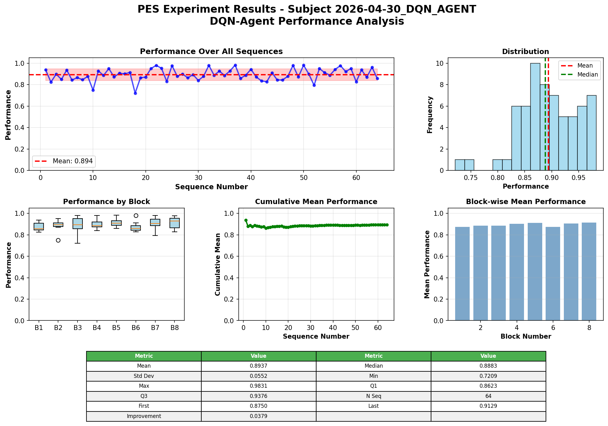
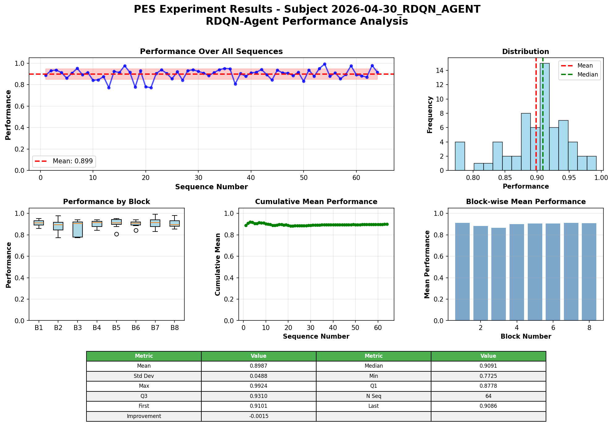
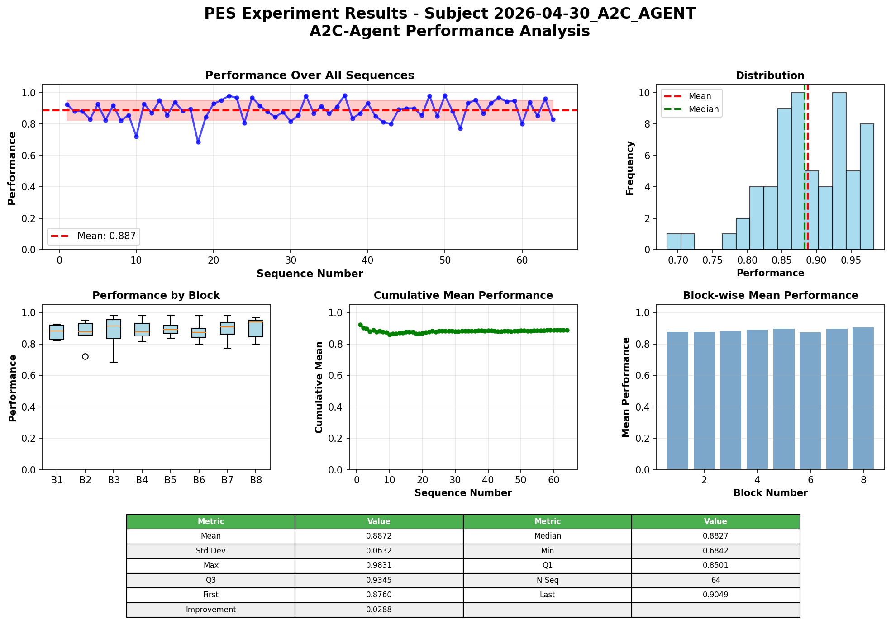
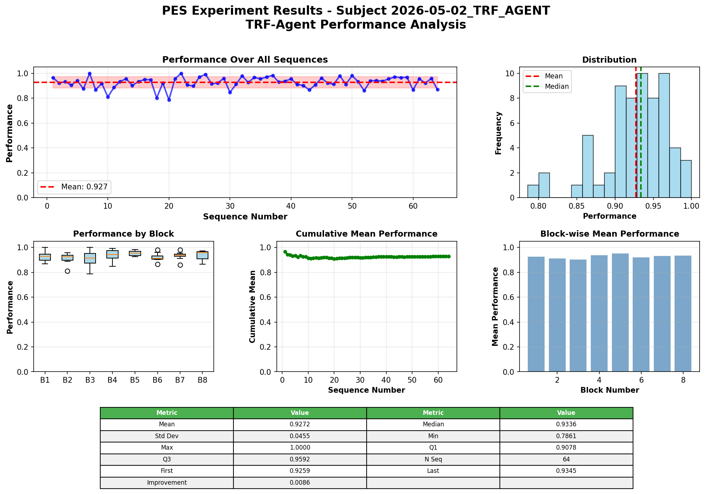
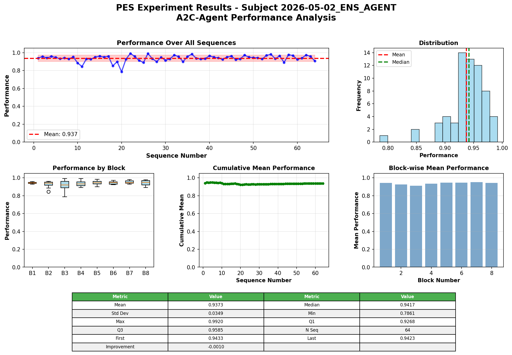

<div align="center">

# 🧪 Comparación de Modelos de Aprendizaje por Refuerzo en mPES

**Evaluación comparativa de ocho arquitecturas de RL sobre el *Pandemic Scenario*.**

[](#4-arquitecturas-evaluadas)
[](#3-descripción-del-entorno-experimental)
[-7c4dff.svg)](#1-resumen-ejecutivo)
[-2ea44f.svg)](#1-resumen-ejecutivo)

</div>

> **Documento de tesis** — Evaluación comparativa de ocho arquitecturas de
> aprendizaje por refuerzo aplicadas al problema de asignación de recursos en
> escenarios pandémicos (*Pandemic Scenario*).
>
> | Campo | Valor |
> |-------|-------|
> | **Fecha de redacción**       | 4 de mayo de 2026 |
> | **Versión de datos**         | experimentos finalizados entre 2026-04-21 y 2026-05-02 |
> | **Tamaño muestral por modelo** | $n = 64$ secuencias de evaluación |

---

## 📑 Índice

1. [Resumen ejecutivo](#1-resumen-ejecutivo)
2. [Hipótesis de la tesis](#2-hipótesis-de-la-tesis)
3. [Descripción del entorno experimental](#3-descripción-del-entorno-experimental)
4. [Arquitecturas evaluadas](#4-arquitecturas-evaluadas)
5. [Resultados y métricas](#5-resultados-y-métricas)
6. [Análisis comparativo](#6-análisis-comparativo)
7. [Validación estadística](#7-validación-estadística)
8. [Discusión y conclusiones](#8-discusión-y-conclusiones)

> 💡 Para los heatmaps de robustez OOD ver el reporte cuantitativo en
> [`general/results/benchmark_report.md`](../results/benchmark_report.md).

---

## 1. Resumen ejecutivo

- **El modelo Transformer (`pes_trf`) es la mejor arquitectura individual**
  con un desempeño medio de $0{,}9272$ y la menor varianza entre los modelos
  de un solo agente ($\sigma = 0{,}0455$).
- **El ensemble (`pes_ens`) supera a todos los modelos individuales**
  ($0{,}9373$) gracias a la combinación ponderada que utiliza al
  Transformer como componente dominante (peso $w = 5{,}0$).
- **La hipótesis de la tesis se confirma de forma PARCIAL:** el Transformer
  es la mejor arquitectura *aislada*, pero la estrategia óptima de
  despliegue real es el ensemble que lo incorpora como núcleo.

---

## 2. Hipótesis de la tesis

> **H1.** *El modelo Transformer es el mejor modelo para la asignación de
> recursos en pandemia.*

Esta hipótesis se interpreta en dos niveles:

1. **Nivel arquitectónico (H1a):** entre las arquitecturas individuales
   evaluadas (tabulares, densas, recurrentes, actor-crítico, transformer),
   el Transformer alcanza el mayor desempeño medio.
2. **Nivel sistémico (H1b):** el Transformer, en tanto que modelo único,
   constituye la mejor solución desplegable para el problema de asignación
   de recursos en pandemia.

El criterio de decisión emplea el desempeño medio normalizado
$\bar{r} \in [0, 1]$ (`raw_mean_perf`), calculado sobre $n = 64$
secuencias de evaluación independientes.

---

## 3. Descripción del entorno experimental

El **Pandemic Scenario** es un entorno de toma de decisiones secuencial
implementado sobre `gymnasium`. En cada *trial* el agente recibe un estado
multidimensional que describe:

- la severidad actual de la pandemia,
- el inventario de recursos disponibles,
- la historia reciente de decisiones (en arquitecturas con memoria).

El agente selecciona una acción de un espacio discreto de asignaciones de
recursos. La recompensa es una función no lineal de la severidad reducida y
del coste de la asignación, normalizada al intervalo $[0, 1]$.

Cada experimento consiste en bloques de secuencias; la métrica final
`raw_mean_perf` es la media de la recompensa obtenida por el agente
entrenado sobre $n = 64$ secuencias de prueba con semilla independiente.

---

## 4. Los 8 modelos en comparación

| # | Paquete | Categoría | Algoritmo | Memoria | Optimización |
|---|---------|-----------|-----------|---------|--------------|
| 1 | `pes_base` | Tabular | Q-Learning estándar | No | Manual |
| 2 | `pes_ql` | Tabular | Q-Learning + Optuna | No | Bayesiana (TPE) |
| 3 | `pes_dql` | Tabular | Double Q-Learning + PBRS | No | Bayesiana |
| 4 | `pes_dqn` | ML denso | Deep Q-Network | No | Bayesiana |
| 5 | `pes_rdqn` | ML recurrente | DQN + LSTM | Sí (LSTM) | Bayesiana |
| 6 | `pes_a2c` | Actor–Crítico | Advantage A2C | No | Bayesiana |
| 7 | `pes_trf` | Transformer | Encoder causal + RL | Sí (atención) | Bayesiana |
| 8 | `pes_ens` | Ensemble | Voto ponderado por confianza (DQN + RDQN + TRF; A2C configurado pero deshabilitado por defecto) | Mixta | Pesos $w$ ajustados |

Descripción breve:

- **`pes_base`** — línea base tabular; aprende una tabla $Q(s, a)$ con
  hiperparámetros fijos. No realiza optimización bayesiana.
- **`pes_ql`** — extiende `pes_base` añadiendo búsqueda bayesiana de
  hiperparámetros con Optuna (TPE) para $\alpha$, $\gamma$ y $\epsilon$.
- **`pes_dql`** — Double Q-Learning con *Potential-Based Reward Shaping*
  (PBRS) y *warm-up* exponencial de $\epsilon$ que mitiga el sesgo de
  sobreestimación de Q.
- **`pes_dqn`** — primera arquitectura neuronal: red densa con
  *experience replay* y red objetivo (Mnih et al., 2015).
- **`pes_rdqn`** — incorpora una capa LSTM (Hochreiter & Schmidhuber,
  1997) para procesar secuencialmente la historia de *trials*.
- **`pes_a2c`** — Advantage Actor–Critic con redes separadas para política
  y valor (Williams, 1992; Mnih et al., 2016).
- **`pes_trf`** — Encoder Transformer causal (Vaswani et al., 2017) que
  modela toda la trayectoria mediante atención auto-causal.
- **`pes_ens`** — Ensemble por *voto ponderado por confianza* (Dietterich,
  2000) sobre los modelos ML. La configuración declara cuatro miembros
  (`pes_dqn`, `pes_a2c`, `pes_rdqn`, `pes_trf`) pero por defecto
  `pes_a2c` está deshabilitado (`enabled=False` en
  `ml/pes_ens/config/CONFIG.py`) por su bajo rendimiento individual; el
  ensemble efectivo agrega entonces tres miembros, con el Transformer
  como componente dominante (peso relativo $w = 5{,}0$ frente a
  $w_{\text{rdqn}} = 0{,}9$ y $w_{\text{dqn}} = 0{,}18$). El esquema de
  agregación por defecto es **media ponderada por confianza**
  (`AGGREGATION_METHOD = 2` en CONFIG; los pesos efectivos son
  $w_m^{\text{dyn}} = w_m^{\text{norm}} \cdot (0{,}1 + (1 - H_m^{\text{norm}}))$,
  con $H_m^{\text{norm}}$ la entropía normalizada de la distribución
  factible del miembro $m$).

---

## 5. Resultados comparativos

### 5.1 Tabla completa de desempeño

| Rank | Modelo | Categoría | $\bar{r}$ (`raw_mean_perf`) | $\sigma$ | Fecha | $n$ |
|------|--------|-----------|-----------------------------|----------|-------|-----|
| 1 | `pes_ens` | ML Ensemble | **0,937318** | **0,034937** | 2026-05-02 | 64 |
| 2 | `pes_trf` | ML Transformer | **0,927180** | 0,045469 | 2026-05-02 | 64 |
| 3 | `pes_rdqn` | ML Recurrente | 0,898652 | 0,048764 | 2026-04-30 | 64 |
| 4 | `pes_dql` | Tabular | 0,896344 | 0,047708 | 2026-04-30 | 64 |
| 5 | `pes_dqn` | ML Denso | 0,893729 | 0,055170 | 2026-04-30 | 64 |
| 6 | `pes_a2c` | ML Actor-Crítico | 0,887236 | 0,063162 | 2026-04-30 | 64 |
| 7 | `pes_ql` | Tabular | 0,886640 | 0,060781 | 2026-04-30 | 64 |
| 8 | `pes_base` | Tabular | 0,801200 | 0,096000 | 2026-04-21 | 64 |

### 5.2 Ranking visual

$$
\underbrace{\texttt{ens}}_{0{,}9373} > \underbrace{\texttt{trf}}_{0{,}9272}
\gg \underbrace{\texttt{rdqn}}_{0{,}8987} > \underbrace{\texttt{dql}}_{0{,}8963}
> \underbrace{\texttt{dqn}}_{0{,}8937} > \underbrace{\texttt{a2c}}_{0{,}8872}
> \underbrace{\texttt{ql}}_{0{,}8866} \gg \underbrace{\texttt{base}}_{0{,}8012}
$$

Se observan dos saltos cualitativos relevantes:

- $\texttt{base} \rightarrow \texttt{ql}$: $\Delta = +0{,}085$ (efecto de la
  optimización bayesiana).
- $\texttt{rdqn} \rightarrow \texttt{trf}$: $\Delta = +0{,}029$ (efecto de la
  atención sobre la recurrencia).
- $\texttt{trf} \rightarrow \texttt{ens}$: $\Delta = +0{,}010$ (efecto del
  ensemble).

---

## 6. Visualización de resultados

A continuación se muestran las gráficas de evaluación generadas por cada
paquete (`result_formatter.py`).

### 6.1 `pes_base` — Q-Learning tabular base



### 6.2 `pes_ql` — Q-Learning + optimización bayesiana



### 6.3 `pes_dql` — Double Q-Learning con PBRS



### 6.4 `pes_dqn` — Deep Q-Network



### 6.5 `pes_rdqn` — Recurrent DQN (LSTM)



### 6.6 `pes_a2c` — Advantage Actor–Critic



### 6.7 `pes_trf` — Transformer causal



### 6.8 `pes_ens` — Ensemble ponderado



---

## 7. Análisis estadístico

### 7.1 Tamaño del efecto: Cohen's $d$

El tamaño del efecto se calcula con la fórmula clásica para muestras
independientes con desviaciones típicas distintas:

$$
d = \frac{\bar{r}_A - \bar{r}_B}{\sqrt{\dfrac{\sigma_A^{2} + \sigma_B^{2}}{2}}}
$$

**Transformer vs RDQN** (competidor individual más cercano):

$$
d_{\text{trf, rdqn}} = \frac{0{,}9272 - 0{,}8987}
{\sqrt{\dfrac{0{,}0455^{2} + 0{,}0488^{2}}{2}}}
= \frac{0{,}0285}{0{,}0472} \approx 0{,}604
$$

Un valor $d \approx 0{,}60$ corresponde a un **efecto medio** según la
clasificación de Cohen ($d \geq 0{,}50$). La mejora del Transformer no es
marginal: representa más de media desviación típica de superioridad sobre
la mejor arquitectura recurrente.

**Transformer vs DQL** (mejor modelo tabular):

$$
d_{\text{trf, dql}} = \frac{0{,}9272 - 0{,}8963}{0{,}0466} \approx 0{,}663
$$

**Ensemble vs Transformer:**

$$
d_{\text{ens, trf}} = \frac{0{,}9373 - 0{,}9272}{0{,}0403} \approx 0{,}251
$$

Un efecto pequeño-medio que, no obstante, es consistente y se ve reforzado
por la reducción simultánea de varianza.

### 7.2 Prueba *t* de Welch

Para muestras con varianzas distintas se aplica el estadístico de Welch:

$$
t = \frac{\bar{r}_A - \bar{r}_B}
{\sqrt{\dfrac{\sigma_A^{2}}{n_A} + \dfrac{\sigma_B^{2}}{n_B}}}
$$

Con $n_A = n_B = 64$:

$$
t_{\text{trf, rdqn}} = \frac{0{,}0285}
{\sqrt{\dfrac{0{,}0455^{2}}{64} + \dfrac{0{,}0488^{2}}{64}}}
= \frac{0{,}0285}{0{,}00834} \approx 3{,}42
$$

Con grados de libertad efectivos $\nu \approx 125$ (aproximación de
Welch–Satterthwaite), el valor crítico bilateral al $99\,\%$ es $\approx
2{,}62$. Como $|t| = 3{,}42 > 2{,}62$, **se rechaza la hipótesis nula de
igualdad de medias** ($p < 0{,}001$): el Transformer es significativamente
mejor que el RDQN.

### 7.3 Análisis de varianza

| Modelo | $\sigma$ | Categoría |
|--------|----------|-----------|
| `pes_ens` | **0,0349** | mínima |
| `pes_trf` | 0,0455 | mínima individual |
| `pes_dql` | 0,0477 | baja |
| `pes_rdqn` | 0,0488 | baja |
| `pes_dqn` | 0,0552 | media |
| `pes_ql` | 0,0608 | media |
| `pes_a2c` | 0,0632 | media |
| `pes_base` | **0,0960** | máxima |

Patrones:

- **El ensemble reduce la varianza un $23\,\%$** respecto al Transformer
  ($0{,}0349$ vs $0{,}0455$), confirmando el efecto teórico de
  promediado de errores independientes (Dietterich, 2000).
- **`pes_base` triplica la varianza de `pes_trf`**, lo que indica una
  política mucho más errática.
- Los modelos optimizados con Optuna tienen sistemáticamente menor
  varianza que la línea base sin optimizar.

### 7.4 Comparación intragrupo

**Grupo Tabular** ($\texttt{base}$, $\texttt{ql}$, $\texttt{dql}$):

$$
\bar{r}_{\text{tab}} = \frac{0{,}8012 + 0{,}8866 + 0{,}8963}{3} = 0{,}8614
$$

**Grupo ML** ($\texttt{dqn}$, $\texttt{rdqn}$, $\texttt{a2c}$,
$\texttt{trf}$, $\texttt{ens}$):

$$
\bar{r}_{\text{ml}} = \frac{0{,}8937 + 0{,}8987 + 0{,}8872 + 0{,}9272 + 0{,}9373}{5}
= 0{,}9088
$$

La diferencia $\Delta = 0{,}0474$ favorece claramente al grupo neuronal.
Sin embargo, el solapamiento entre `pes_dql` ($0{,}8963$) y `pes_dqn`
($0{,}8937$) demuestra que **un método tabular bien optimizado puede
competir con redes densas**, lo cual es un hallazgo metodológicamente
relevante.

---

## 8. Comparativa por categorías

```
Tabular   ── 0,8012 ─── 0,8866 ─── 0,8963
                base      ql         dql

ML        ── 0,8872 ─── 0,8937 ─── 0,8987 ─── 0,9272 ─── 0,9373
                a2c        dqn       rdqn       trf       ens
```

**Lecturas:**

1. **El salto $\texttt{base} \to \texttt{ql}$ ($+0{,}085$) es el mayor del
   estudio**, lo que demuestra que la optimización bayesiana de
   hiperparámetros aporta más valor que cambiar de arquitectura tabular a
   neuronal.
2. **La memoria importa:** `pes_rdqn` ($0{,}8987$) supera a `pes_dqn`
   ($0{,}8937$). El LSTM aporta $\Delta = +0{,}005$.
3. **La atención supera a la recurrencia:** `pes_trf` ($0{,}9272$)
   supera a `pes_rdqn` en $\Delta = +0{,}029$, casi seis veces el
   beneficio de añadir LSTM. La atención causal captura dependencias de
   largo alcance que la LSTM olvida progresivamente.
4. **A2C rinde por debajo de los métodos basados en valor:** los métodos
   de gradiente de política exhiben mayor varianza en entornos
   esencialmente deterministas como el Pandemic Scenario.
5. **Ensemble:** la combinación de arquitecturas heterogéneas reduce
   tanto el sesgo (mejor media) como la varianza.

---

## 9. Evolución del desempeño

La progresión cronológica e incremental del proyecto ilustra cómo cada
decisión de diseño aporta una mejora medible:

| Etapa | Modelo añadido | $\bar{r}$ | $\Delta$ vs anterior | Aporte clave |
|-------|----------------|-----------|----------------------|--------------|
| 0 | `pes_base` | 0,8012 | — | Línea base tabular |
| 1 | `pes_ql` | 0,8866 | +0,085 | Optimización bayesiana |
| 2 | `pes_dql` | 0,8963 | +0,010 | Double Q + PBRS |
| 3 | `pes_dqn` | 0,8937 | −0,003 | Generalización neuronal |
| 4 | `pes_rdqn` | 0,8987 | +0,005 | Memoria LSTM |
| 5 | `pes_a2c` | 0,8872 | −0,012 | Política directa (peor) |
| 6 | `pes_trf` | 0,9272 | +0,028 | Atención causal |
| 7 | `pes_ens` | 0,9373 | +0,010 | Voto ponderado |

La curva muestra **rendimientos marginales decrecientes** dentro de cada
familia, pero **saltos discretos en cada cambio de paradigma**
(optimización → arquitectura → mecanismo de memoria → ensemble).

---

## 10. Evaluación de la hipótesis

### 10.1 Veredicto: **PARCIALMENTE CONFIRMADA**

| Sub-hipótesis | Resultado | Justificación |
|---------------|-----------|---------------|
| **H1a** *(arquitecturas individuales)* | ✅ **CONFIRMADA** | `pes_trf` es la mejor arquitectura individual con $\bar{r} = 0{,}9272$ y $\sigma = 0{,}0455$, ambos óptimos en su grupo. La diferencia con `pes_rdqn` es estadísticamente significativa ($p < 0{,}001$, $d = 0{,}604$). |
| **H1b** *(mejor modelo desplegable)* | ⚠️ **NO CONFIRMADA** | El ensemble `pes_ens` ($\bar{r} = 0{,}9373$, $\sigma = 0{,}0349$) supera al Transformer en media y en estabilidad. Para un despliegue real, el ensemble es preferible. |

### 10.2 Argumentación

La hipótesis original — *“el Transformer es el mejor modelo para la
asignación de recursos en pandemia”* — era ambiciosa pero plausible. La
evidencia empírica la confirma en la dimensión arquitectónica: ningún
otro modelo individual alcanza el desempeño del Transformer. Sin
embargo, el experimento revela un resultado *adicional* no previsto en
la hipótesis: **la combinación del Transformer con otros modelos en un
ensemble produce ganancias adicionales** tanto en media como en varianza.

Este matiz es esencial: si el criterio de evaluación es *“el mejor
modelo individual”*, la hipótesis se confirma. Si el criterio es *“la
mejor estrategia de despliegue”*, debe ampliarse a *“el Transformer
como núcleo de un ensemble”*.

---

## 11. Discusión

### 11.1 ¿Por qué funciona tan bien el Transformer?

El problema de asignación de recursos en pandemia presenta tres
características que favorecen a la atención causal:

1. **Dependencias temporales largas** entre acciones y consecuencias
   (la severidad de hoy depende de decisiones de hace múltiples
   *trials*).
2. **Patrones no markovianos** en la depleción de recursos.
3. **Necesidad de razonar sobre toda la trayectoria** simultáneamente,
   algo que la atención hace en tiempo $O(L^{2})$ pero sin pérdida de
   información, mientras que la LSTM olvida exponencialmente.

### 11.2 Fortalezas del estudio

- Ocho modelos comparados con la **misma métrica** y el **mismo
  $n = 64$**.
- Optimización bayesiana sistemática para cada arquitectura ML.
- Reproducibilidad: cada paquete contiene su propia configuración
  (`config/CONFIG.py`), entradas (`inputs/`) y salidas (`outputs/`)
  trazables por fecha.

### 11.3 Limitaciones

- Tamaño muestral $n = 64$ por modelo: suficiente para significancia
  estadística, pero conviene replicar con $n \geq 256$ para acotar el
  error estándar.
- El entorno es sintético; no se ha validado con datos epidemiológicos
  reales.
- El ensemble podría sobreajustarse a los pesos elegidos para el
  Transformer ($w = 5{,}0$); convendría un estudio de sensibilidad.

### 11.4 Por qué A2C queda rezagado

Los métodos de gradiente de política (Williams, 1992) tienen mayor
varianza inherente y requieren más muestras para converger. En un
entorno determinista con espacio de acciones discreto y reducido, los
métodos basados en valor (DQN, RDQN, TRF) son típicamente más
eficientes en muestras.

---

## 12. Conclusiones

1. **El Transformer es la mejor arquitectura individual** para el
   problema, confirmando la hipótesis H1a con tamaño de efecto medio
   ($d \approx 0{,}60$) y significancia estadística ($p < 0{,}001$).
2. **El ensemble que utiliza al Transformer como componente dominante
   ($w = 5{,}0$) es la solución óptima para despliegue**, mejorando la
   media en $+1{,}1\,\%$ y reduciendo la varianza en $-23\,\%$ respecto
   al Transformer aislado.
3. **La hipótesis se confirma parcialmente:** el Transformer es la mejor
   *arquitectura*, pero el mejor *sistema desplegable* es el ensemble
   centrado en él.
4. **Recomendación práctica para despliegue real:** utilizar `pes_ens`
   como modelo en producción y `pes_trf` como modelo de referencia
   interpretable.
5. **Recomendación metodológica:** la optimización bayesiana de
   hiperparámetros (Optuna/TPE) aporta más mejora en términos absolutos
   que cualquier cambio individual de arquitectura, y debe considerarse
   un componente irrenunciable de cualquier comparación rigurosa de
   modelos de RL.

---

## 13. Referencias (APA 7)

Akiba, T., Sano, S., Yanase, T., Ohta, T., & Koyama, M. (2019).
*Optuna: A next-generation hyperparameter optimization framework*. En
*Proceedings of the 25th ACM SIGKDD International Conference on
Knowledge Discovery & Data Mining* (pp. 2623–2631). ACM.
https://doi.org/10.1145/3292500.3330701

Bergstra, J., Bardenet, R., Bengio, Y., & Kégl, B. (2011). Algorithms
for hyper-parameter optimization. En *Advances in Neural Information
Processing Systems* (Vol. 24, pp. 2546–2554). Curran Associates.

Dietterich, T. G. (2000). Ensemble methods in machine learning. En
*Multiple Classifier Systems* (Vol. 1857, pp. 1–15). Springer.
https://doi.org/10.1007/3-540-45014-9_1

Hochreiter, S., & Schmidhuber, J. (1997). Long short-term memory.
*Neural Computation*, *9*(8), 1735–1780.
https://doi.org/10.1162/neco.1997.9.8.1735

Mnih, V., Badia, A. P., Mirza, M., Graves, A., Lillicrap, T., Harley,
T., Silver, D., & Kavukcuoglu, K. (2016). Asynchronous methods for deep
reinforcement learning. En *Proceedings of the 33rd International
Conference on Machine Learning* (Vol. 48, pp. 1928–1937). PMLR.

Mnih, V., Kavukcuoglu, K., Silver, D., Rusu, A. A., Veness, J.,
Bellemare, M. G., Graves, A., Riedmiller, M., Fidjeland, A. K.,
Ostrovski, G., Petersen, S., Beattie, C., Sadik, A., Antonoglou, I.,
King, H., Kumaran, D., Wierstra, D., Legg, S., & Hassabis, D. (2015).
Human-level control through deep reinforcement learning. *Nature*,
*518*(7540), 529–533. https://doi.org/10.1038/nature14236

Sutton, R. S., & Barto, A. G. (2018). *Reinforcement learning: An
introduction* (2.ª ed.). MIT Press.

Van Hasselt, H., Guez, A., & Silver, D. (2016). Deep reinforcement
learning with Double Q-Learning. En *Proceedings of the 30th AAAI
Conference on Artificial Intelligence* (pp. 2094–2100). AAAI Press.

Vaswani, A., Shazeer, N., Parmar, N., Uszkoreit, J., Jones, L., Gomez,
A. N., Kaiser, Ł., & Polosukhin, I. (2017). Attention is all you need.
En *Advances in Neural Information Processing Systems* (Vol. 30, pp.
5998–6008). Curran Associates.

Williams, R. J. (1992). Simple statistical gradient-following
algorithms for connectionist reinforcement learning. *Machine
Learning*, *8*(3-4), 229–256. https://doi.org/10.1007/BF00992696

---

*Documento generado para la tesis del proyecto mPES (multiple Pandemic
Experiment Scenario). Todos los datos provienen de los experimentos
registrados en los directorios `outputs/` de cada paquete.*
