# Comparación de modelos mPES

> Informe generado a partir de los resultados disponibles en `h1/general/results/`.
> La comparación usa 22 escenarios, 64 secuencias por celda y
> `sev_base` como baseline.

## Metodología

La métrica comparada es `global_mean_perf`, el rendimiento normalizado que
registran los experimentos del harness de estrés. Para cada modelo se informa:

- rendimiento en el escenario empírico;
- media de rendimiento en los 21 escenarios restantes;
- degradación media respecto al baseline, calculada como `baseline - media_bajo_estres`;
- mayor degradación observada y escenario donde ocurre.

### Baselines empleados

El estudio usa **dos baselines distintos**, según el eje de comparación:

1. **Baseline de escenario (condición de referencia): `sev_base`.**
   Es la *distribución empírica de entrenamiento* de cada paquete: reutiliza
   sin perturbar los `initial_severity.csv` y `sequence_lengths.csv` reales del
   modelo (es el único escenario marcado `is_baseline=True`). Representa las
   "condiciones normales", idénticas a las de entrenamiento, frente a las que
   se mide la degradación bajo estrés. Es el escenario que fija
   `REFERENCE_SCENARIO` en el harness.

2. **Baseline de modelo (agente de referencia): `pes_base`.**
   Q-Learning tabular. Solo se usa en los mapas $\Delta$ centrados en
   `pes_base` (definidos en la sección de notación) para comparar cada modelo
   frente al agente tabular base. Fija `REFERENCE_MODEL` en el harness.

La **degradación media** de un modelo $m$ es el promedio con signo de la caída
de rendimiento respecto a su propia condición de referencia `sev_base`:

$$
\overline{D}_m=\frac{1}{|S|}\sum_{s\in S}\bigl(\mu_{m,\mathrm{base}}-\mu_{m,s}\bigr),
$$

donde $S$ son los 21 escenarios distintos de la referencia. Un valor
**positivo** indica pérdida de rendimiento bajo estrés; uno **negativo**
indica que el modelo rinde mejor bajo estrés que en el baseline. Al ser un
promedio con signo (no valor absoluto), mejoras y pérdidas se compensan. La
mayor caída individual (`worst_degradation`) es:

$$
\max_{s\in S}\bigl(\mu_{m,\mathrm{empirical}}-\mu_{m,s}\bigr).
$$

### Notación y rendimiento normalizado

Para una secuencia $i$, el rendimiento normalizado registrado por el harness
es:

$$
\bar r_i = P_i =
\frac{S_{\mathrm{worst},i}-S_{\mathrm{final},i}}
{S_{\mathrm{worst},i}-S_{\mathrm{best},i}},
\qquad 0 \leq P_i \leq 1.
$$

Aquí $S_{\mathrm{final},i}$ es la severidad final observada, y los límites de
referencia de la secuencia son:

$$
S_{\mathrm{worst},i} \;=\; \text{peor severidad alcanzable}, \qquad
S_{\mathrm{best},i} \;=\; \text{mejor severidad alcanzable}.
$$

El desempeño medio de un modelo $m$ en un escenario $s$ es:

$$
\mu_{m,s}=\frac{1}{n_s}\sum_{i=1}^{n_s}P_{m,s,i},
\qquad n_s=64
$$

Los valores cercanos a $1$ indican mayor reducción relativa de severidad; los
valores cercanos a $0$ indican menor desempeño normalizado. La comparación no
debe interpretar $\bar r_i$ como una probabilidad.

Para evitar ambigüedad, los mapas centrados en `pes_base` usan la diferencia
$\Delta^{\mathrm{base}}$ entre el rendimiento del modelo base y el del modelo
$m$ en cada escenario $s$:

$$
\Delta^{\mathrm{base}}_{m,s}=\mu_{\mathrm{base},s}-\mu_{m,s}.
$$

La interpretación del signo es:

$$
\Delta^{\mathrm{base}}_{m,s} > 0 \;\Rightarrow\; m \text{ pierde frente a la base}, \qquad
\Delta^{\mathrm{base}}_{m,s} < 0 \;\Rightarrow\; m \text{ la supera}.
$$

Los mapas históricos de degradación respecto al propio baseline de cada modelo
usan, en cambio, la diferencia frente a la condición empírica:

$$
\Delta^{\mathrm{emp}}_{m,s}=\mu_{m,\mathrm{empirical}}-\mu_{m,s}.
$$

Los resultados individuales proceden de `pes_ql`, `pes_dql`, `pes_dqn`,
`pes_rdqn`, `pes_a2c` y `pes_trf`. Los ensembles incluyen `pes_ens`,
`pes_ens_sprb`, `pes_ens_accq`, `pes_ens_consensus`,
`pes_ens_consensus_prior` y `pes_ens_trf_guard`.

La ejecución reproducible del análisis es:

```powershell
cd h1
..\win_mpes_env\Scripts\python.exe -m general.scripts.analysis
..\win_mpes_env\Scripts\python.exe -m general.scripts.figures
```

El análisis no reentrena modelos: consume los JSON y matrices ya generados.

## Métricas estadísticas

Las comparaciones pareadas se calculan sobre las observaciones de rendimiento
de las 64 secuencias de cada escenario de estrés común a todos los modelos de
una suite. Se excluye `sev_base` para que el contraste mida el
comportamiento bajo estrés y no una diferencia debida únicamente al baseline.

### $p$ de Welch

La prueba t de Welch contrasta si las medias de dos modelos pueden considerarse
iguales sin asumir varianzas iguales. Para muestras $x$ e $y$ usa:

$$
t = \frac{\bar{x}-\bar{y}}
{\sqrt{s_x^2/n_x+s_y^2/n_y}}
$$

Los grados de libertad aproximados son:

$$
\nu=\frac{(s_x^2/n_x+s_y^2/n_y)^2}
{\frac{(s_x^2/n_x)^2}{n_x-1}+\frac{(s_y^2/n_y)^2}{n_y-1}}.
$$

El valor $p$ bilateral es $p=2\Pr(T_\nu\geq |t|)$. En los heatmaps se
representa $\log_{10}(p)$: valores más negativos indican evidencia más fuerte
contra la igualdad de medias. El mapa no demuestra causalidad ni garantiza
que el efecto sea importante en términos operativos.

El grado de libertad se estima con la aproximación de Welch-Satterthwaite.
El informe usa la prueba bilateral. Un valor $p$ pequeño indica evidencia de
una diferencia de medias, pero no mide por sí mismo la importancia práctica.
No se aplica una corrección por comparaciones múltiples; por ello los valores
$p$ se presentan como evidencia exploratoria, no como confirmación causal.

### $d$ de Cohen

El tamaño de efecto estandarizado se calcula como:

$$
d = \frac{\bar{x}-\bar{y}}{s_{pooled}}
$$

con

$$
s_{pooled}=\sqrt{\frac{(n_x-1)s_x^2+(n_y-1)s_y^2}
{n_x+n_y-2}}.
$$

Su signo indica qué modelo tiene la media mayor y su magnitud expresa la
diferencia en desviaciones estándar. Como referencia descriptiva, valores
cercanos a $0.2$, $0.5$ y $0.8$ suelen interpretarse como efectos pequeño,
medio y grande, respectivamente. En este informe se priorizan conjuntamente
$p$ y $d$, porque una muestra grande puede producir un $p$ pequeño para una
diferencia poco relevante.

### Divergencia de Kullback-Leibler

La expresión solicitada como “distancia de Lieber” se interpreta aquí como la
divergencia de Kullback-Leibler (KL), una medida estándar de diferencia entre
distribuciones. Para evitar depender del orden de los modelos se informa la
versión simétrica:

$$
D_{KL}^{sym}(P,Q) = \frac{1}{2}\left(D_{KL}(P\Vert Q)+D_{KL}(Q\Vert P)\right)
$$

En los mapas de acciones, $P$ y $Q$ son las distribuciones empíricas sobre las
11 acciones $\{0,\ldots,10\}$; en las comparaciones de rendimiento son
histogramas con 20 bins comunes en $[0,1]$. Se añade $\varepsilon=10^{-9}$ y
se renormaliza para evitar $\log(0)$. KL cercana a cero indica perfiles
similares; valores mayores indican decisiones o rendimientos distribuidos de
forma distinta. KL no tiene unidades y no es un $p$-valor.

## Heatmaps estadísticos por escenario

Además de los contrastes pareados entre modelos, se generan heatmaps para
observar cómo cambia cada métrica en los escenarios de severidad, longitud,
conjuntos y estructura. Cada fila representa un modelo y cada columna un
escenario; `sev_base` es el baseline de referencia.

### Heatmaps individuales

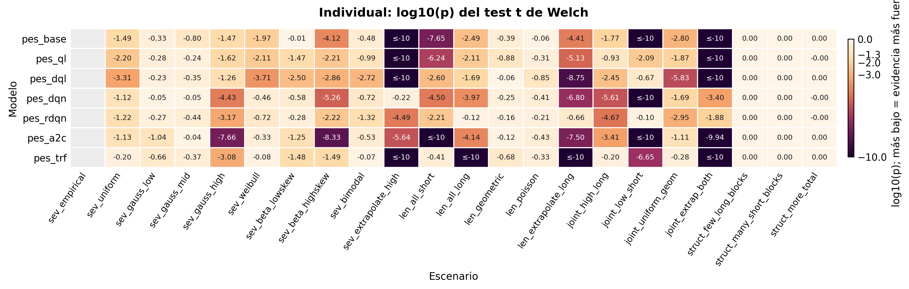

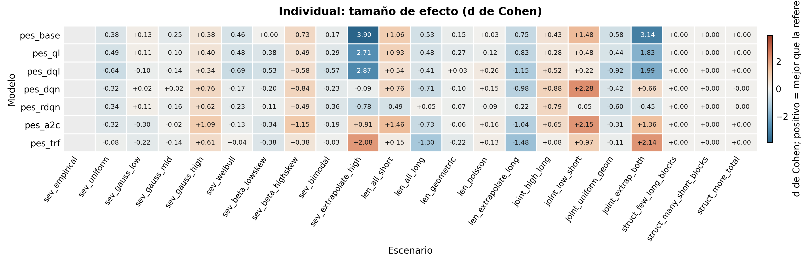

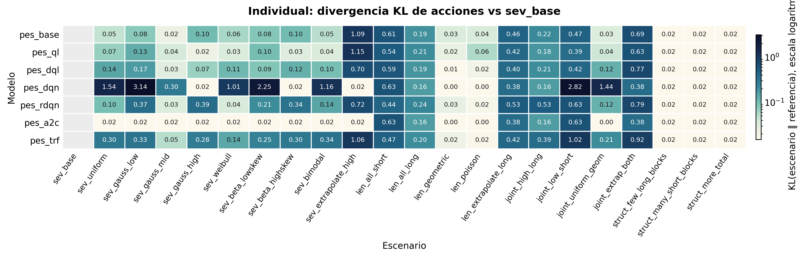

### Heatmaps de ensembles

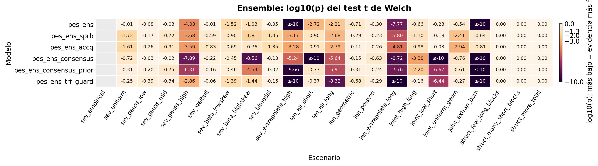

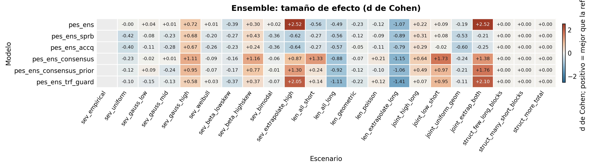

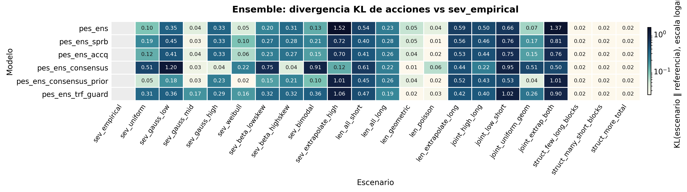

Los mapas de degradación por escenario complementan lo anterior:

- [Degradación por escenario, individuales](../results/individual/figures/02_degradacion_por_escenario.png)
- [Degradación por escenario, ensembles](../results/ensemble/figures/02_degradacion_por_escenario.png)

En estos mapas, un $p$ de Welch menor indica evidencia más fuerte de una
diferencia frente al baseline. El valor de Cohen conserva el signo de la
diferencia de rendimiento respecto al baseline; un signo positivo indica
mejor rendimiento en el escenario y uno negativo indica pérdida. La KL por
escenario compara la **distribución de acciones** del escenario con la de la
condición de referencia del mismo modelo, es decir mide el desplazamiento de
la política y no del rendimiento.

### Cómo leer las figuras

Todas las figuras comparten las convenciones definidas en `plotting.py`:

- **Color por modelo**: cada paquete conserva el mismo color en todas las
  figuras (`MODEL_COLOURS`). El mejor modelo de cada suite (`pes_trf`,
  `pes_ens`) usa el acento cálido `#c44e52`; el resto una escala
  azul–verde–ámbar.
- **Trazo grueso**: en toda figura que superpone varios modelos (05, 06, 11,
  histogramas y recompensas) el modelo con mayor media en los 21 escenarios
  de perturbación se dibuja con trazo grueso y se nombra en el título
  ("trazo grueso = …"). En el ranking (08) ese modelo se destaca con borde
  negro y etiqueta en negrita.
- **Leyendas**: una única fila compartida debajo de los paneles o del eje;
  en la figura 06 de la suite individual, donde el par de modelos cambia por
  panel, cada panel lleva su propia leyenda en la esquina inferior derecha.
- **Mapa de desempeño**: comparar colores dentro de una columna permite ordenar modelos en un escenario; comparar una fila muestra sensibilidad del mismo modelo al estrés.
- **Mapa de degradación**: colores positivos señalan pérdida frente a la referencia y negativos mejora. La escala divergente debe leerse alrededor de cero, no por el color más intenso de forma aislada.
- **Mapa de Welch**: valores más bajos de $\log_{10}(p)$ indican mayor evidencia estadística, pero deben acompañarse con $d$ de Cohen.
- **Mapa de Cohen**: el signo indica dirección y la magnitud el tamaño del cambio en desviaciones estándar; un efecto grande no implica por sí mismo generalización uniforme.
- **Mapa de KL**: valores altos indican mayor cambio en la distribución de acciones o rendimientos; no indican qué modelo tiene mejor media.
- **Curvas por secuencia**: cada panel ordena de menor a mayor desempeño; una curva más alta domina en esa condición. En la figura 06 las líneas punteadas marcan la media de cada modelo y permiten separar rendimiento global de variabilidad entre secuencias. En la suite individual la figura 06 contrasta `pes_trf` con un modelo por panel (`pes_dql`, `pes_a2c`, `pes_dqn`); en la suite de ensembles dibuja las seis variantes.

## Modelos individuales

| Modelo | Baseline | Media bajo estrés | Degradación media | Mayor degradación | Escenario crítico |
|---|---:|---:|---:|---:|---|
| `pes_trf` | 0.927 | **0.930** | **-0.002** | 0.068 | `len_extrapolate_long` |
| `pes_dqn` | 0.894 | 0.899 | -0.005 | 0.053 | `len_extrapolate_long` |
| `pes_a2c` | 0.887 | 0.896 | -0.009 | 0.062 | `len_extrapolate_long` |
| `pes_rdqn` | 0.899 | 0.889 | 0.010 | 0.068 | `sev_extrapolate_high` |
| `pes_dql` | 0.896 | 0.877 | 0.019 | 0.111 | `sev_extrapolate_high` |
| `pes_ql` | 0.887 | 0.871 | 0.015 | 0.124 | `sev_extrapolate_high` |
| `pes_base` | 0.871 | 0.851 | 0.020 | 0.244 | `sev_extrapolate_high` |

`pes_trf` obtiene el mejor rendimiento individual tanto en el baseline como
en la media bajo estrés. `pes_dqn` y `pes_a2c` también presentan una media
bajo estrés superior a su baseline. Los modelos tabulares son los más
afectados por `sev_extrapolate_high`; `pes_base`, sin optimización
bayesiana, registra la mayor caída de toda la suite (0.244).

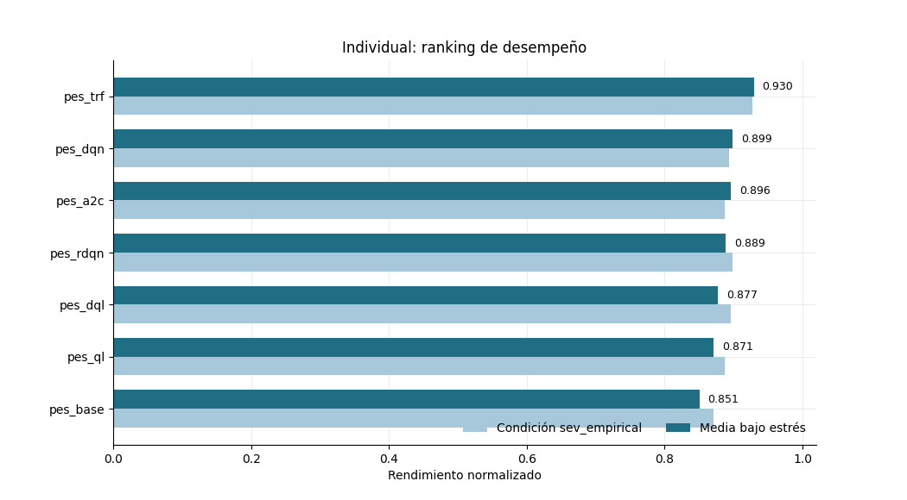

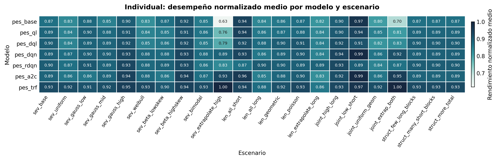

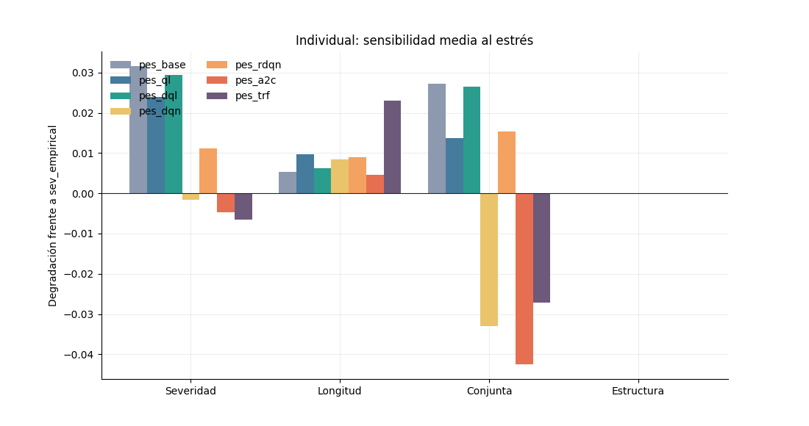

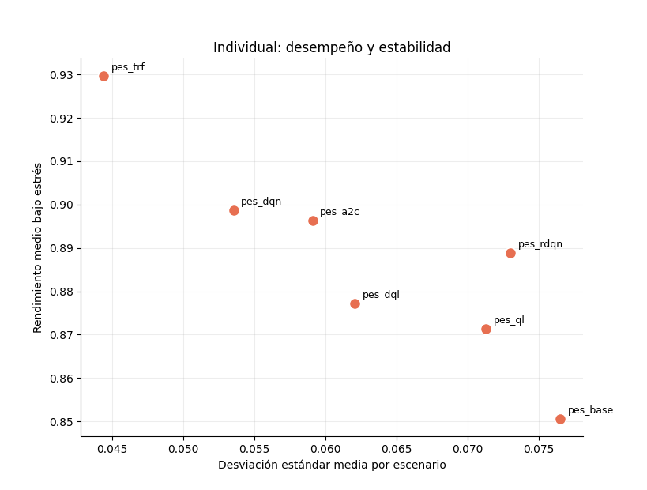

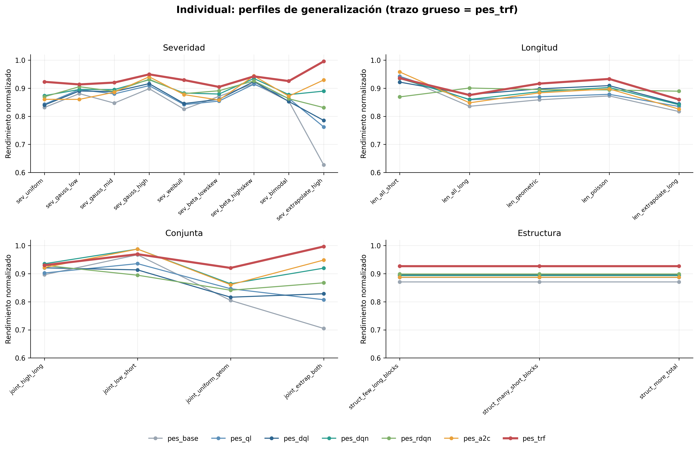

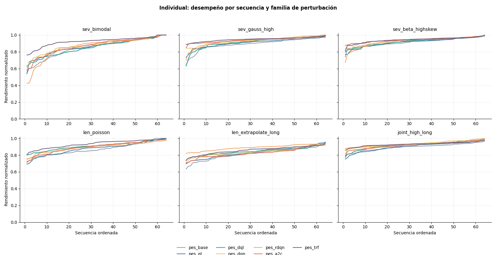

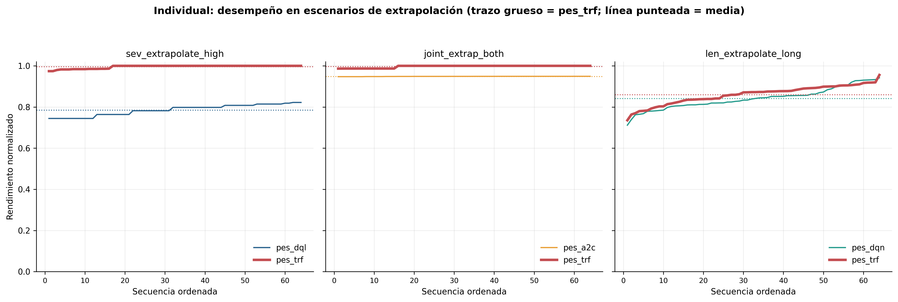

### Contrastes pareados individuales

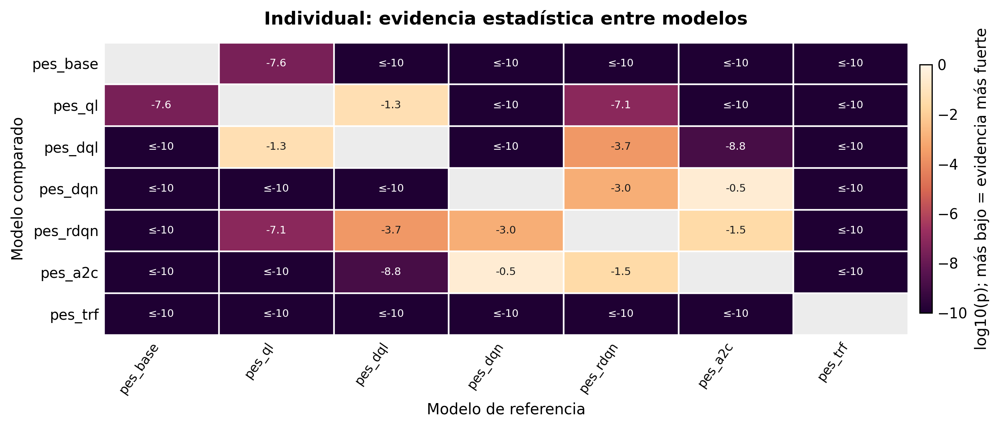

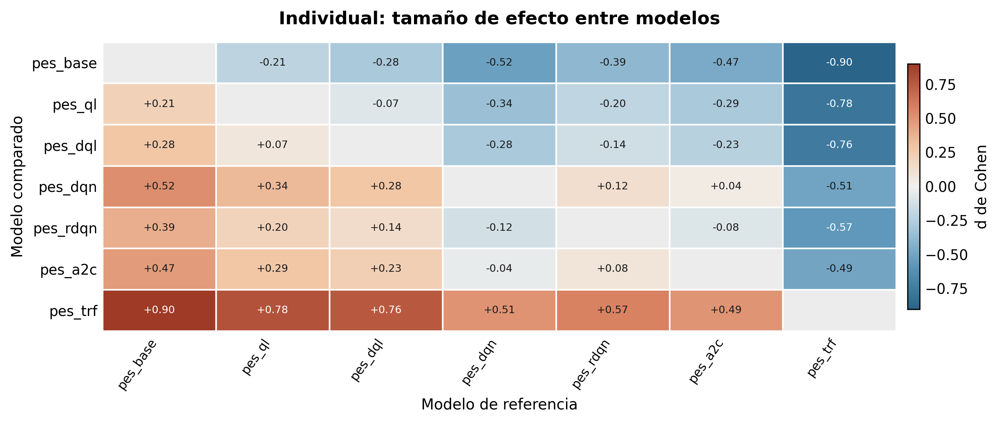

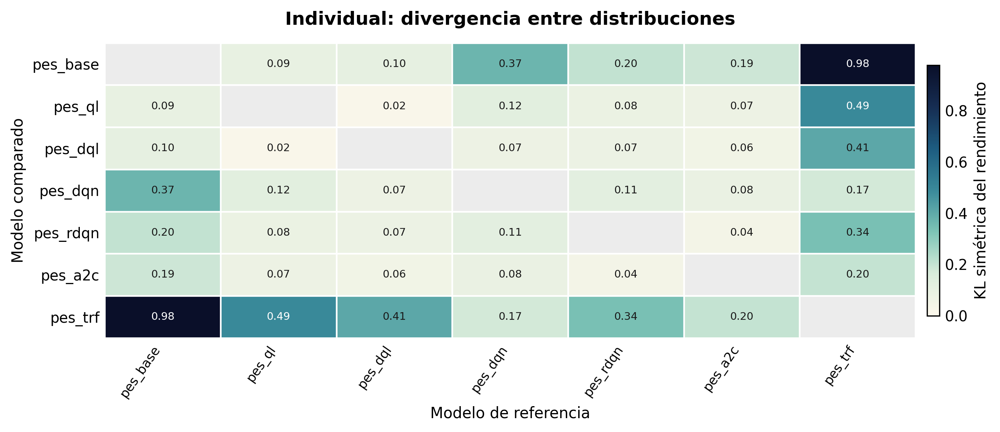

## Ensembles

| Ensemble | Baseline | Media bajo estrés | Degradación media | Mayor degradación | Escenario crítico |
|---|---:|---:|---:|---:|---|
| `pes_ens` | **0.937** | **0.939** | **-0.002** | **0.037** | `len_extrapolate_long` |
| `pes_ens_trf_guard` | 0.928 | 0.931 | -0.003 | 0.067 | `len_extrapolate_long` |
| `pes_ens_consensus_prior` | 0.918 | 0.923 | -0.005 | 0.042 | `len_extrapolate_long` |
| `pes_ens_consensus` | 0.893 | 0.904 | -0.010 | 0.063 | `len_extrapolate_long` |
| `pes_ens_sprb` | 0.914 | 0.902 | 0.012 | 0.054 | `sev_extrapolate_high` |
| `pes_ens_accq` | 0.914 | 0.901 | 0.013 | 0.055 | `sev_extrapolate_high` |

`pes_ens` presenta la mejor media bajo estrés y la menor degradación máxima.
`pes_ens_trf_guard` queda segundo en media bajo estrés y mantiene un desempeño
cercano al de `pes_trf`. `pes_ens_sprb` y `pes_ens_accq` son los ensembles que
más retroceden frente a su baseline, ambos ante `sev_extrapolate_high`.

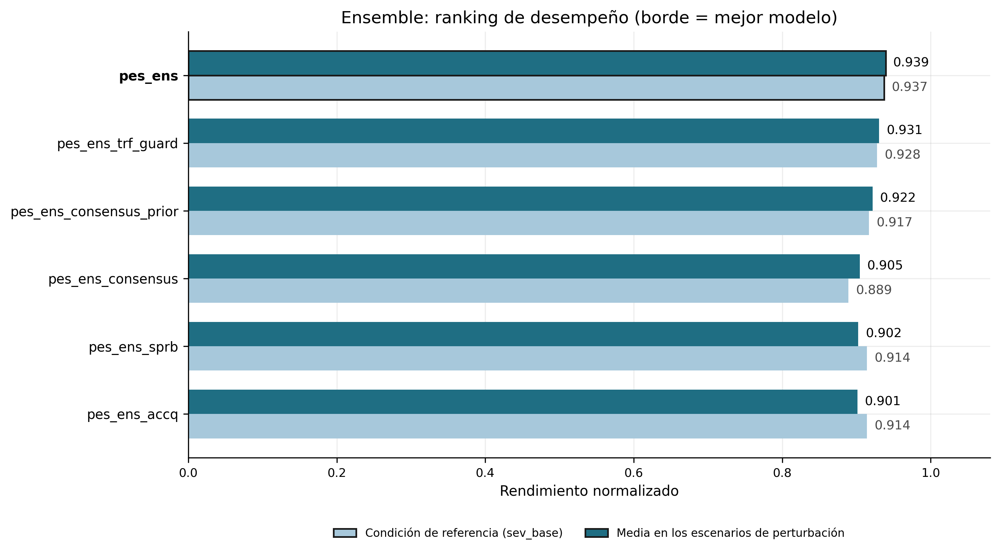

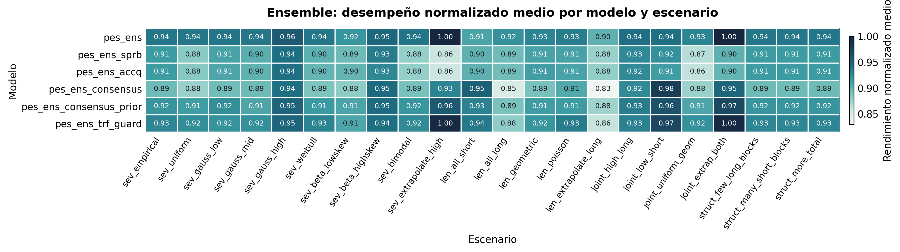

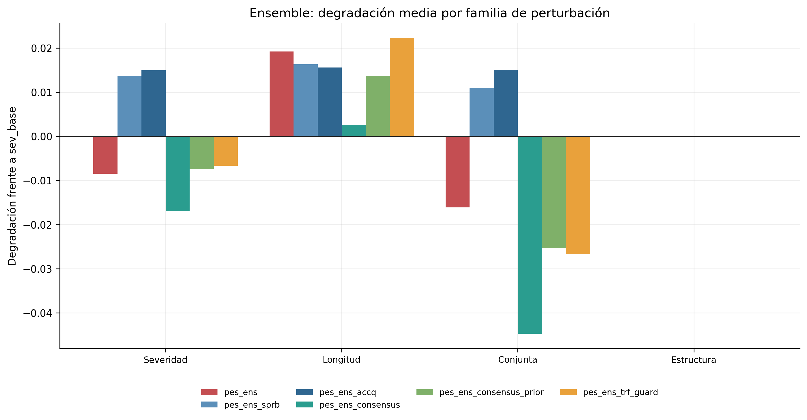

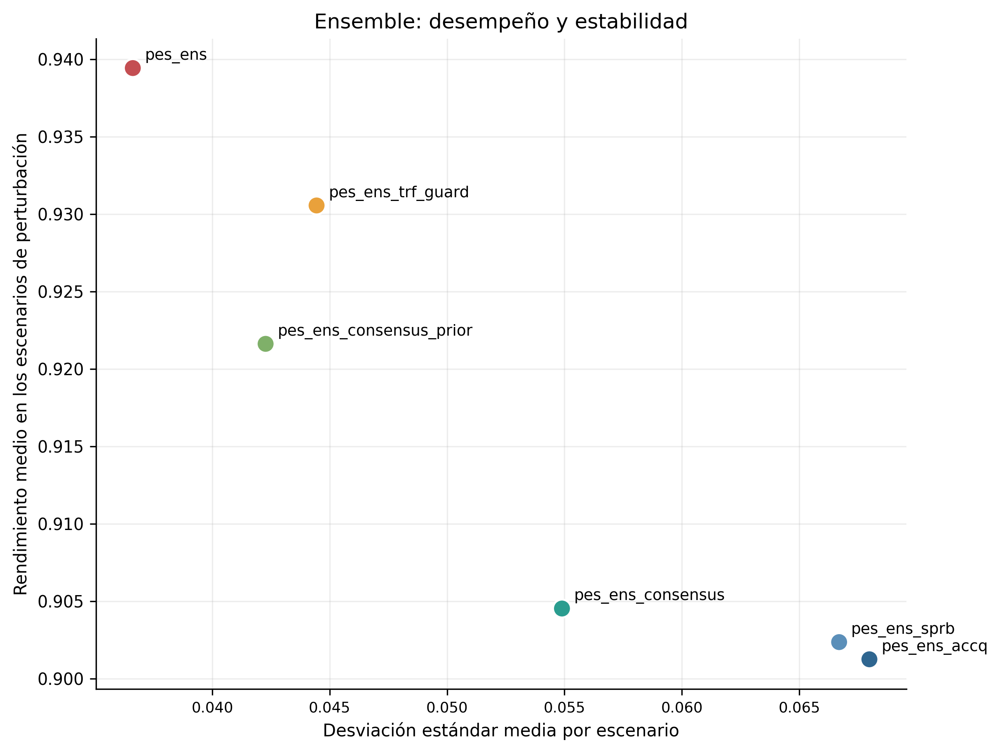

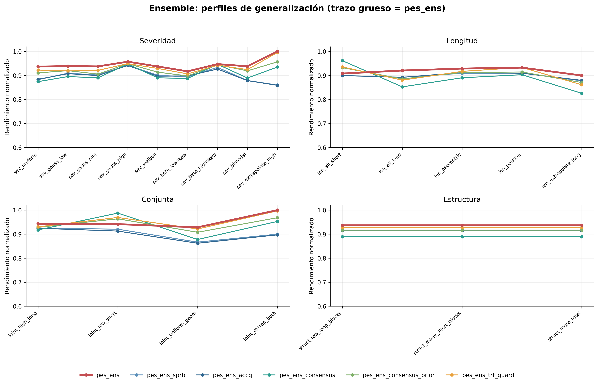

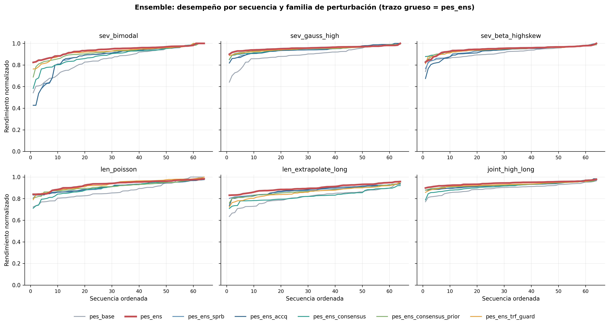

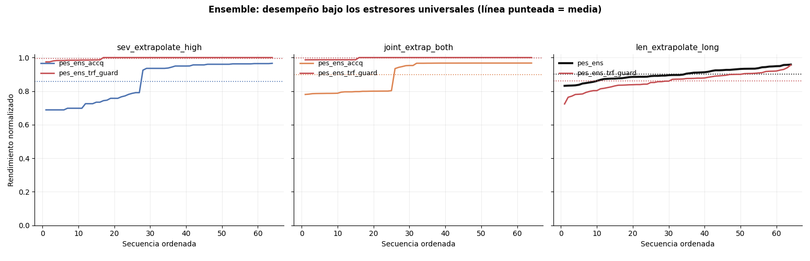

### Contrastes pareados de ensembles

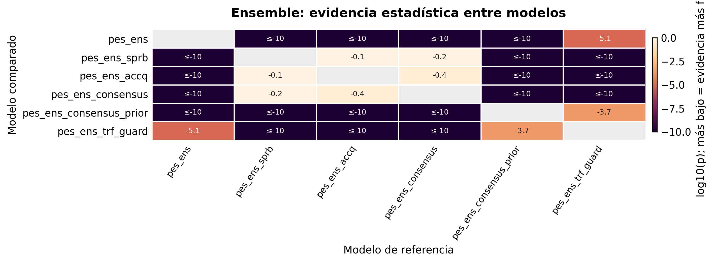

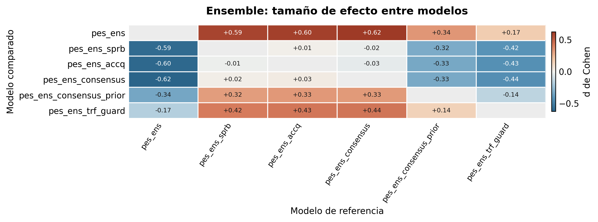

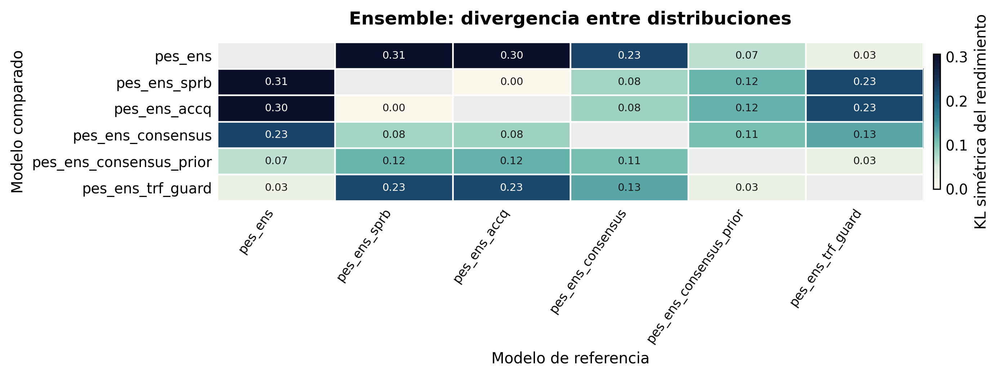

## Lectura comparativa

- El mejor resultado individual es `pes_trf`, con media bajo estrés de 0.930.
- El mejor resultado entre ensembles es `pes_ens`, con media bajo estrés de 0.939 y degradación máxima de 0.037.
- `pes_ens_trf_guard` es el ensemble activo más próximo al Transformer individual en rendimiento bajo estrés.
- La extrapolación alta de severidad es el principal punto débil de `pes_base`, `pes_ql`, `pes_dql`, `pes_rdqn`, `pes_ens_sprb` y `pes_ens_accq`.
- La extrapolación de longitud es el escenario crítico de `pes_dqn`, `pes_a2c`, `pes_trf` y de los ensembles con degradación media negativa.
- En los contrastes pareados, `pes_trf` frente a `pes_ql` presenta $p \approx 1.63\times10^{-88}$ y $d \approx 0.78$.
- Entre ensembles, `pes_ens` frente a `pes_ens_consensus` presenta $p \approx 2.77\times10^{-56}$ y $d \approx 0.62$.
- Los perfiles de generalización permiten distinguir si el rendimiento se conserva cuando cambian por separado la severidad inicial, la longitud de secuencia, sus combinaciones y la estructura del experimento.

Las figuras en formato `.png` y las métricas completas en
JSON se encuentran junto a cada suite:

- [`results/individual/figures`](../results/individual/figures)
- [`results/ensemble/figures`](../results/ensemble/figures)

## Referencias

- Cohen, J. (1988). *Statistical Power Analysis for the Behavioral Sciences* (2nd ed.). Lawrence Erlbaum Associates.
- Kullback, S., & Leibler, R. A. (1951). On information and sufficiency. *The Annals of Mathematical Statistics, 22*(1), 79–86. [https://doi.org/10.1214/aoms/1177729694](https://doi.org/10.1214/aoms/1177729694)
- Welch, B. L. (1947). The generalization of “Student's” problem when several different population variances are involved. *Biometrika, 34*(1–2), 28–35. [https://doi.org/10.1093/biomet/34.1-2.28](https://doi.org/10.1093/biomet/34.1-2.28)
